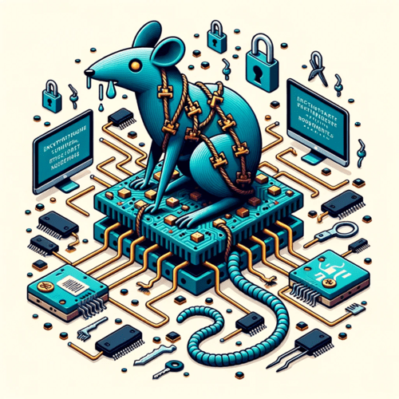
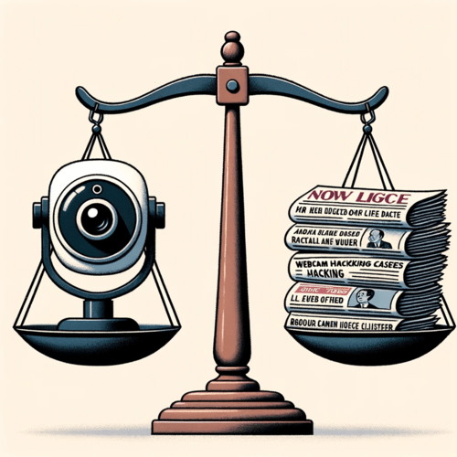
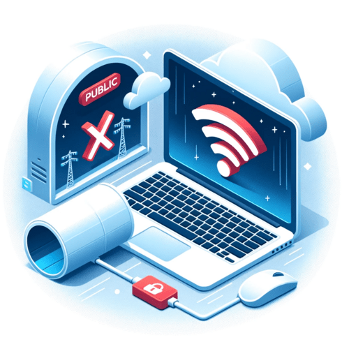

Introduction
============

Webcam hacking, while not making headlines daily, remains a serious threat that both individuals and organizations need to take seriously. Once hackers gain access to a webcam, they can potentially observe the victim without consent and misuse or share private images or videos. High-profile cases of webcam hacking have included cybercriminals spying on people in their homes, schools using webcam monitoring software to track students, and even incidents of hackers accessing workplace webcams to steal company secrets. The consequences of webcam breaches can be devastating for victims, destroying reputations, relationships, and public trust.

Securing your devices against unauthorized webcam access should be a priority for anyone concerned about their privacy and security in the digital age. While webcams provide useful features for video calls, surveillance and more, basic precautions like covering the lens when not in use, keeping software updated and avoiding oversharing on social media can help reduce your risks. Understanding the capabilities of hackers and taking proactive steps to safeguard your webcam is essential for your protection.

Understanding Webcams and their Vulnerabilities
===============================================

A webcam is a video camera that feeds or streams its image in real time to or through a computer to computer network. Webcams are typically small cameras that sit on a desk, attach to a user's monitor, or are built into the hardware itself.

At the basic level, a webcam consists of a lens, an image sensor, and supporting electronics. The lens focuses light onto the image sensor, which converts the light into an electrical signal. The sensor then transmits this image data to the computer for processing. Many webcams have a built-in microphone so they can capture audio as well as video.

When connected to the internet, these webcams can allow images and videos to be viewed and shared across computer networks and on websites. This real-time streaming ability is what makes webcams appealing for applications such as video conferencing, recording video logs, live broadcasts, and surveillance. However, it also introduces vulnerabilities.

One of the biggest risks with webcams is the potential for remote access and exploitation. As webcams are connected to a network, it provides an opening for hackers to breach the system and take control of the video feed. This could allow them to access private spaces and activities within a person's home or work environment.

Webcams are also prone to intercepting unencrypted communications. The video feeds may be transmitted in an insecure manner, making it easy for others to intercept and view them. There have been cases of criminal webcam scams where attackers have accessed webcam feeds to gather private images and videos for blackmail or extortion.

The physical placement of webcams can also lead to vulnerabilities. If a webcam does not have adequate controls, it may capture more of a space than intended. Positioning webcams in private areas like bedrooms and bathrooms heightens the risk of invasions of privacy if accessed by malicious actors.

Overall, while webcams provide useful functionality, their streaming capabilities mean they can transmit private images and data. Without proper encryption and access controls, webcams introduce risks of remote exploitation, interception of communications, and invasions of privacy. Understanding these vulnerabilities is key to using webcams safely and securely.

How Hackers Access Your Webcam
==============================

Hackers employ various devious techniques access webcams without the owner's consent or knowledge. Gaining unauthorized access allows them to view, record, and exploit private webcam feeds for criminal purposes.

Techniques Used by Hackers to Gain Access
-----------------------------------------

The most common method is through malicious software known as Remote Access Trojans (RATs). RATs can be secretly installed via phishing emails, compromised websites, or social engineering. Once installed, they allow complete remote access to the victim's machine.

Browser or Flash exploits are another technique. Hackers can exploit vulnerabilities in browsers or plugins to inject malicious code onto the target device. This code forcibly enables the webcam without any prompt or indication to the user.

Wi-Fi snooping utilizes packet sniffing tools to intercept unencrypted webcam traffic on a shared network. This allows hackers to view feeds from insecure webcams that connect via Wi-Fi.

Physical access is also a risk. If hackers can physically access a device, even briefly, they can manually install RATs or other malware to enable remote access.

Social engineering relies on manipulating users into installing RATs themselves. Hackers pose as tech support or use other pretexts to deceive victims into unwittingly compromising their own security.

Explanation of Remote Access Trojans (RATs)
-------------------------------------------

Remote Access Trojans are sophisticated hacking tools that provide complete remote control over a victim's computer.

Once installed via phishing, drive-by-downloads or physical access, RATs allow hackers to silently access webcams, record video/audio, log keystrokes, access files and covertly install other malware.

Advanced RATs like BlackShades and DarkComet even allow hackers to remotely view and control the infected computer's screen. This provides live video feeds from active webcams as if they were physically operating the device.

To avoid detection, RATs use encryption, obfuscation and anti-virus evasion techniques. They often disguise themselves as legitimate programs and hide their presence using rootkits or by modifying system settings.

Uninstalling RATs can be challenging since they embed themselves deep in the system. A factory reset or even replacing the hard drive may be required to fully purge a RAT infection. Preventing the initial infection is crucial.

Real-Life Instances of Webcam Hacking
=====================================

Unfortunately, webcam hacking is not just a hypothetical threat. There have been several troubling real-world cases of webcam breaches. These incidents reveal the disturbing reality of how violating and dangerous webcam hacks can be.

One of the most well-known examples is the webcam hacking scandal involving Miss Teen USA Cassidy Wolf in 2013. Wolf's webcam was hacked by a cybercriminal who took private photos and videos of her in her bedroom. The hacker attempted to extort Wolf by threatening to release the files. This chilling case showed that even prominent public figures are vulnerable to webcam hacking.

In another alarming incident in 2009, a Lower Merion School District was accused of secretly activating webcams on school-issued laptops. The webcams captured images of students in their homes, often without their knowledge. The district claimed the webcams were for locating lost or stolen laptops. However, the practice was deemed an egregious invasion of privacy.

The suicide of Canadian teen Amanda Todd in 2012 also highlighted the dangers of webcam hacking. Todd was coerced by a cybercriminal into exposing herself via webcam. The hacker later released an explicit video of Todd online, leading to extensive bullying. This tragedy demonstrated how webcam hacks can have devastating mental health consequences.

While these cases are disturbing, they reveal valuable lessons. We must recognize that webcam hacks do occur and can seriously endanger privacy and well-being. Being vigilant about webcam security is essential. These real-world examples emphasize why precautions against webcam hacking are so critical. The potentially life-shattering impact of these crimes must not be underestimated.

Signs Your Webcam Has Been Hacked
=================================

Your webcam light turning on spontaneously can be one of the clearest signs your webcam has been hacked. Webcams include LED indicator lights that illuminate when the camera is active. If this light comes on by itself without you intentionally activating the webcam, it likely means remote access malware has enabled the camera surreptitiously. Strange noises coming from your speakers when the webcam isn't in use could also indicate a hacker has accessed the microphone.

You may also notice performance issues with your computer that result from malware and other invasive software running in the background. Signs can include slowed Internet speeds, randomly freezing programs, and spikes in CPU usage even when you aren't running resource-intensive applications. This unusual behavior may accompany a webcam hack.

Carefully checking your computer's installed programs and browser extensions can reveal suspicious or unknown apps that may be malware granting access to your webcam. Cybercriminals often mask malicious software with innocuous names, so looking up unfamiliar programs is wise. You can also use the Windows Task Manager to view all currently running processes and look for any unusual ones that could signal an intrusion.

Out-of-date software and operating systems that have not been patched to fix known vulnerabilities can leave you exposed to exploits. If you are neglecting to regularly update and patch your computer, your chances of experiencing a webcam hack drastically increase. Essential security practices like updating can prevent many hacking attempts.

You may also sometimes notice strange occurrences within your webcam's field of view, like subtle shifts in positioning. This could occur if a hacker has obtained access and is manually controlling the webcam. Subtle lighting changes and clarity issues can also stem from remote adjustments to your webcam's settings.

Checking your router logs can help determine if an unknown device has established a connection without your authorization. Many hackers will connect to a target's Wi-Fi network first before attempting to infiltrate other aspects of the system. Your router logs can thus provide useful clues about breaches.

In summary, unexplained activity from your webcam light, unusual computer performance, strange software running in the background, neglected updates, odd occurrences in view of the camera, and unauthorized network access seen in router logs can all be signs your webcam has potentially been hacked. Staying vigilant about your computer's status and behavior is key to identifying if your webcam's security has been compromised.

Preventing Webcam Hacking: Practical Steps
==========================================

With the prevalence of webcam hacking, it is crucial to take steps to secure your devices. Practicing good cyber hygiene is the first line of defense.

Importance of Good Cyber Hygiene
--------------------------------

Basic cyber hygiene involves maintaining the security of internet-connected devices. This includes:

-   Keeping software updated - Install the latest security patches and firmware updates which fix vulnerabilities. Hackers exploit unpatched flaws.

-   Using strong passwords - Complex passwords with upper/lowercase letters, numbers and symbols are harder to crack. Avoid reusing passwords across accounts.

-   Being wary of links/attachments - Don't open links or files from unknown sources which may contain malware.

-   Avoiding public Wi-Fi - Public networks can allow snooping of data. Use a VPN if connecting.

Developing good cyber hygiene habits makes you less susceptible to various hacking techniques. It decreases the attack surface.

Steps to Secure Your Webcam
---------------------------

Beyond basic measures, you can take specific steps to secure your webcam:

-   Use tape to cover the webcam when not in use. This physically blocks peeping.

-   Check webcam privacy settings. Disable webcam access for apps not frequently used.

-   Be aware of indicator lights. Most webcams have LED lights that turn on when active.

-   Use antivirus/firewall software to detect malware designed to access the webcam.

-   Disable webcam drivers when not required using Device Manager in Windows.

-   Avoid questionable websites. Malware on malicious sites can hijack your cam.

-   Consider a physical webcam cover that allows the webcam to be uncovered only when needed.

-   For laptops, position the screen away from public view when using the webcam.

With vigilance and the right precautions, webcam hacking can be prevented. Securing your devices should be a priority in this digital age where privacy is fragile.

Advanced Security Measures
==========================

While practicing good cyber hygiene is the first line of defense, there are advanced security measures users can take to further protect their webcams from hackers. Virtual Private Networks (VPNs) and firewalls are two of the most effective tools.

A VPN encrypts all of the data leaving your device. This prevents hackers from intercepting any information transmitted from your webcam. VPNs route your internet connection through their own private servers, hiding your IP address and location. Many hackers locate targets by IP address, so masking it with a VPN makes you much harder to find. VPNs are affordable, user-friendly services that provide an extra layer of webcam security.

Firewalls serve a similar function by acting as a shield around your device. They monitor incoming and outgoing traffic, using rulesets to block potentially dangerous transmissions. Firewalls prevent unauthorized connections that could allow malware or a RAT to access your webcam. They also hide your computer's ports, which hackers target to breach systems. Firewall software should be run on all computers and mobile devices that have a webcam.

Along with VPNs and firewalls, users can consider adding an intrusion detection system (IDS) to their network. IDS systems identify and block suspicious traffic that may be an attempted hacking. Webcam covers are another option when the camera is not in use. However, software protections like VPNs and firewalls provide better security than physical covers.

In summary, VPNs encrypt transmitted data to hide your digital footprint from hackers. Firewalls block unauthorized connections to your machine. And IDS software provides intrusion monitoring. These solutions build on fundamentals like strong passwords and updated software. Taking a layered approach to security is the best way to defend your webcam from potential cyber threats. The peace of mind is well worth the time and money investment.

The Role of Law Enforcement and Legislation
===========================================

Webcam hacking is a crime. Thus, law enforcement plays an important role in investigating, catching, and prosecuting webcam hackers. Police agencies have cybercrime units to combat hacking. They use forensic analysis and surveillance to find perpetrators. Law enforcement also works with computer security researchers and companies to understand the latest hacking techniques.

There are laws that specifically address computer crimes like webcam hacking. In the United States, the Computer Fraud and Abuse Act prohibits unauthorized access to computers and related devices. The Electronic Communications Privacy Act also makes it illegal to intercept private electronic communications without consent. Many states have additional laws against computer trespassing, invasion of privacy, and voyeurism, all of which could apply to illicit webcam access. Countries worldwide have enacted laws to combat cybercrime.
